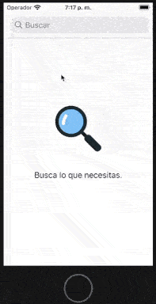
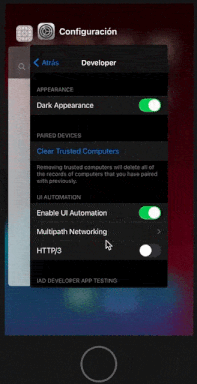
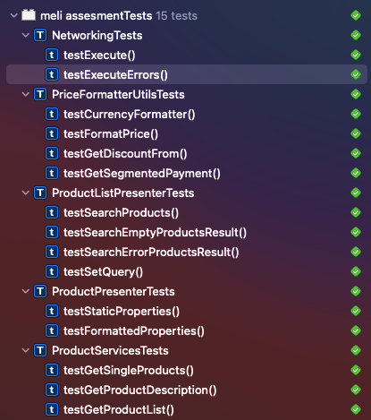

# Mercado Libre Assesment

## Comenzando 🚀

Clona directamente de **master** para tener los últimos cambios del proyecto





## INFO 📖

* Administración del repo mediante **Trunk Base development**
* **Test unitarios** de la lógica de negocio
* Implementado con MVP, Capa de Networking e Inyección de Dependencias


### Pre-requisitos 📋

```
XCODE 12.X
iOS > 11.4
COCOAPODS: 1.10.0
    Alamofire
    Kingfisher
    Firebase/Analytics
    Firebase/Crashlytics
    SwiftLint
    Mocker
```

### Instalación 🔧

```
Pod install
```

## MVP 🛠️
