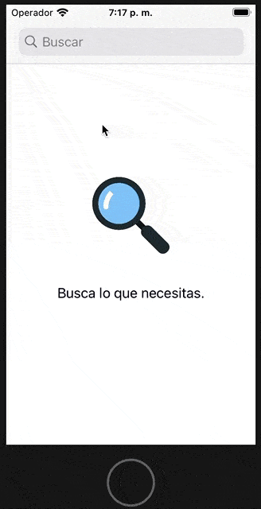

# Mercado Libre Assesment

## Comenzando 🚀

Clona directamente de **master** para tener los últimos cambios del proyecto




## INFO 📖

* Administración del repo mediante **Trunk Base development**
* **Test unitarios** de la lógica de negocio
* Implementado con MVP


### Pre-requisitos 📋

```
COCOAPODS: 1.10.0
```

### Instalación 🔧

```
Pod install
```

## Construido con 🛠️

* COCOAPODS
    * Alamofire
    * Kingfisher
    * Firebase/Analytics
    * Firebase/Crashlytics
    * SwiftLint
    * Mocker